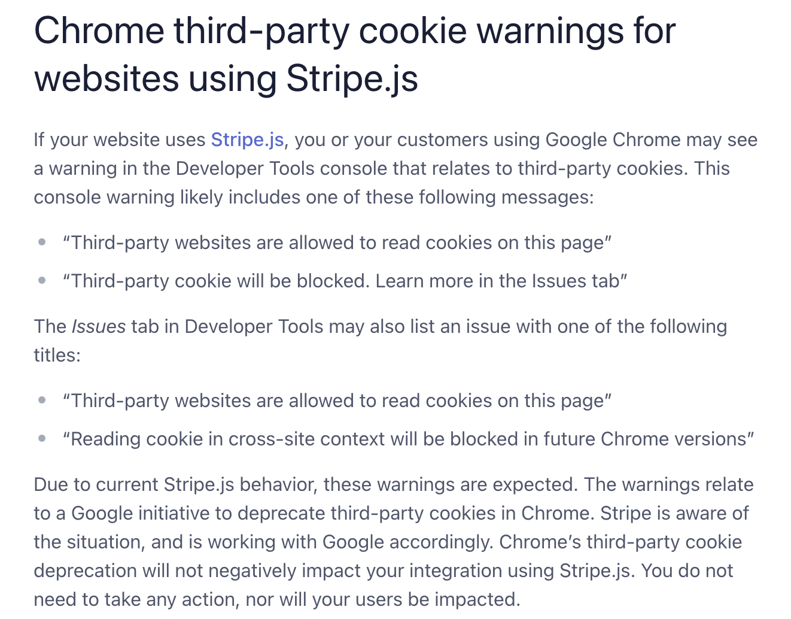

# Redux E-Commerce Site

## Description:

The main goal of this project is to build an e-commerce platform using Redux to manage global state instead of the Context API.

After completion of the project, I have a better understanding on building a full stack MERN application with Redux for state management, Stripe API for generating financial reports and analytics by using a single object to track each process, and the React library to improve the functionality, user experience, and create the VDOM to check and render the DOM. I also learned how to use reducers, mutations, and queries effectively to access and manipulate data.

## Table of Contents:

- [Installation Instructions](#Installation-Instructions)
- [Usage Instructions](#Usage-Instructions)
- [Links](#Links)
- [Features](#Features)
- [Built With](#Built-With)
- [Test Instructions](#Test-Instructions)
- [License](#License)
- [Questions](#Questions)

## Installation Instructions:

Step 1: Clone repository.
 
Step 2: Install Nodejs.
 
Step 3: Install a source-code editor like VsCode.
 
Step 4: Nodemon is recommended in order to refresh and see updated notes data.

## Usage Instructions:

Step 1: Open VsCode(preferred) or another source-code editor if not already running.
 
Step 2: Open integrated terminal once in the main folder.
 
Step 3: "run npm i" / "sudo npm i" in the terminal to install the required dependencies.
 
Step 4: Now to run the application, Enter "npm run build" and then "npm run start", or just "npm run develop" for development.
 
Step 5: After the "VITE v5.2.10 ready in 267 ms" appears in the console, open the local host URL that's displayed in the console if you haven't automatically directed to the application.

## Links

Screenshots:

Render link:
[Render Link](https://redux-e-commerce-site.onrender.com/)

## Features:

Javascript variables, layered destructuring, hooks, reducers, mutations, queries, try/catch methods, async/await methods, event delegation, etc.

## Built With:

- Dynamic JavaScript
- HTML
- CSS
- React
- GrahpQL
- Redux
- Stripe API
- JWT
- Express
- Apollo Server
- MongoDB
- Dotenv
- Vite
- Bootstrap
- License Badge: [Shields.io](https://shields.io/)
- Visual Studio Code: [Website](https://code.visualstudio.com/)

## Test Instructions:

For testing and debugging, the application logs requests and errors in the console. Unit testing not configured. For further debugging feel free to check the sources in Dev Tools for front-end and JavaScript Debug Terminal for backend.

And be aware there is a current issue in the chrome dev tools in regards to blocked cookies with Stripe API. It is completely normal and will not affect the application. For Further reading [Cookie Error](https://support.stripe.com/questions/chrome-third-party-cookie-warnings-for-websites-using-stripe-js).

## License:

Licensed under the The MIT License license.

 (https://opensource.org/licenses/MIT)

## Questions:

For additional questions or concerns, feel free to contact me via [prismhead26@gmail.com](http://prismhead26@gmail.com).
You can also find me on Github at [prismhead26](https://github.com/prismhead26).

© 2024 Aiden Wahed. Confidential and Proprietary. All Rights Reserved.
